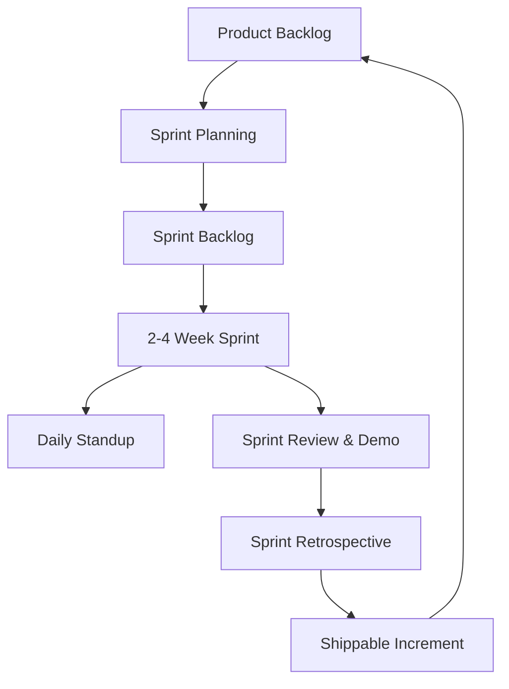
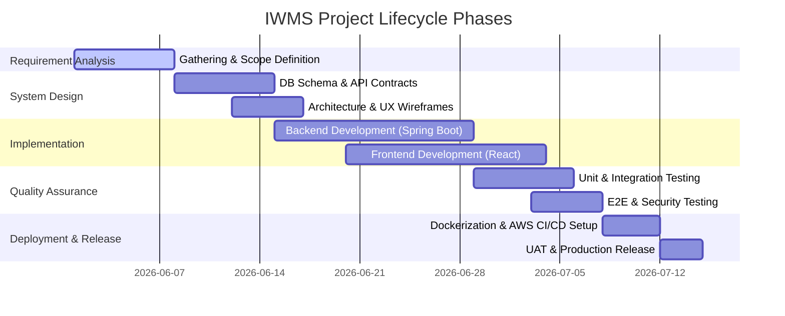

# Software Development Life Cycle (SDLC) Document
## Project: Enterprise Inventory & Warehouse Management System (IWMS)

This document describes the structured development processes and methodologies applied to build, deploy, test, and maintain the IWMS application.

---

## 1. SDLC Methodology: Agile Scrum
We implement the **Agile Scrum** methodology. This enables rapid feedback loops, iterative feature delivery, continuous integration, and flexibility to adapt to changing inventory and supply chain requirements.

### Roles and Responsibilities
- **Product Owner (PO):** Defines business goals, user stories, and prioritizes the Product Backlog.
- **Scrum Master:** Facilitates daily stands, sprint planning, and retrospective sessions, clearing blockages for developers.
- **Development Team:** Full-stack developers, UI/UX engineers, QA testers, and DevOps engineers responsible for delivering clean, verified increments.

---

## 2. Phases of the SDLC

### Phase 1: Requirements Analysis & Specification
During this phase, functional requirements for each user persona were compiled:
- **Administrators:** Require global system control, user provisioning, system logs auditing, and analytical reports.
- **Warehouse Managers:** Require inventory adjustment, supplier records management, transfer validation, and threshold warnings.
- **Warehouse Staff:** Require mobile-responsive interfaces for barcode/QR scanning, instant receipt and dispatch.
- **Sales Team:** Require real-time inventory visibility to generate and trace Sales Orders.

### Phase 2: System Design
The design phase translates functional requirements into technical specifications:
- **System Architecture:** A decoupled structure consisting of a React single page application communicating via RESTful endpoints to a Spring Boot service.
- **Data Architecture:** A normalized relational schema modeled in MySQL to ensure absolute ACID compliance for orders, transfers, and ledger accounting.
- **Caching Layer:** Redis cache stores active user sessions, token blacklists, and high-read static data (e.g., product catalogs, warehouses list) to lower database load.
- **Event-Driven Messaging:** Integration of RabbitMQ (or Kafka) for processing delayed notifications, low-stock warnings, and transactional email triggers asynchronously.

### Phase 3: Implementation & Coding
Development is governed by the following coding guidelines:
- **Backend (Spring Boot):** Clean architecture leveraging Controllers, DTO wrappers, Services, JPA Repositories, and Entity layers. Global exceptions are managed using a `@ControllerAdvice` decorator.
- **Security (Spring Security + JWT):** Stateless token-based security. Filter chain captures request headers, validates JWT validity, loads security context, and handles CORS protocols.
- **Frontend (React + Tailwind):** Modular component organization, Context API for state containment, Axios interceptors to automatically append Auth headers, and Tailwind CSS configuration for modern enterprise aesthetics.

### Phase 4: Testing & Quality Assurance
Quality gates are enforced to guarantee release durability:
- **Static Code Analysis (Linting):** PMD, Checkstyle, and ESLint tools ensure syntactical conformity.
- **Unit Testing:** JUnit 5 and Mockito mock dependencies in services. Jest/React Testing Library verifies React components.
- **Integration Testing:** Testcontainers emulate MySQL and Redis instances locally to validate database actions.
- **Security Auditing:** OWASP ZAP checks API endpoints for JWT hijacking vulnerability and SQL injections.

### Phase 5: Deployment (CI/CD) & DevOps
The application is fully containerized. 
- **Docker Compose:** Configures local dependencies (`mysql`, `redis`, `rabbitmq`) alongside backend and frontend containers.
- **CI/CD Pipeline (GitHub Actions):** On every push to `main`/`release`, actions are triggered to run automated test suites, build Docker images, push images to Amazon ECR, and execute runner scripts to deploy updates on AWS EC2 instances.

### Phase 6: Maintenance & Monitoring
Post-release support ensures high availability:
- **Logging:** SLF4J + Logback output structured JSON logs, indexed by Prometheus/Grafana or ELK stack.
- **APM (Application Performance Monitoring):** Spring Boot Actuator exposes health indicators and telemetry points.
- **Alerting:** PagerDuty/Slack webhooks fire if memory thresholds are exceeded or database connections drop.
